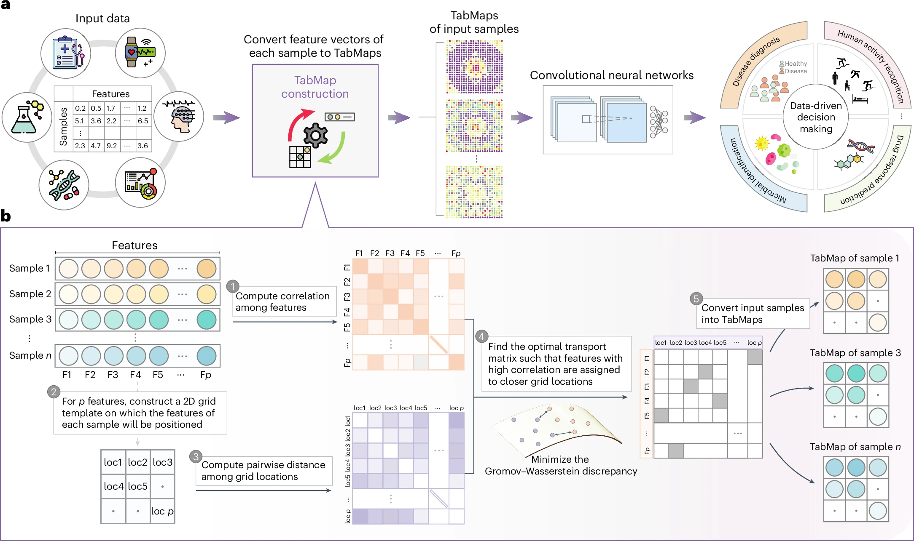

# TabMap

[](https://badge.fury.io/py/tabmap)
### Interpretable Discovery of Patterns in Tabular Data via Spatially Semantic Topographic Maps
Nature Biomedical Engineering, 2024. [HTML](https://www.nature.com/articles/s41551-024-01268-6) | [PDF](https://rdcu.be/dW1Iy) | [Cite](#citation)

**TL;DR:** Python implementation of TabMap proposed in [our paper](https://www.nature.com/articles/s41551-024-01268-6).

- TabMap unravels intertwined relationships in tabular data by transforming each data sample into a spatially semantic 2D topographic map, which we refer to as TabMap.
- A TabMap preserves the original feature values as pixel intensities, with the relationships among the features spatially encoded in the map (the strength of two inter-related features correlates with their distance on the map).
- Our approach makes it possible to apply 2D convolutional neural networks to extract association patterns in the data to facilitate data analysis, and offers interpretability by ranking features according to importance.
- We demonstrate TabMap's superior predictive performance across a diverse set of biomedical datasets.



## Table of Contents
- [Installation](#installation)
- [Train and evaluate the TabMap classifier](#train-and-evaluate-the-tabmap-classifier)
- [Example Jupyter notebooks for using TabMap](#example-jupyter-notebooks-for-using-tabmap)

## Installation
tabmap is available on PyPI. To install tabmap, run the following command:
```
pip install tabmap
```
For development, you can check the latest sources with the command:
```bash
git clone https://github.com/rui-yan/TabMap.git
cd TabMap
conda env create -f tabmap_conda.yml
conda activate tabmap
```

* NVIDIA GPU (Tested on Nvidia Quadro RTX 8000 48G x 1) on local workstations
* Python (3.10.13), torch (1.13.1), numpy (1.23.1), pandas (1.5.3), scikit-learn (1.4.2), scipy (1.10.1), seaborn (0.12.2); For further details on the software and package versions used, please refer to the `tabmap_conda.yml` file.

## Train and evaluate the TabMap classifier
### TabMap construction: transforming tabular data into 2D topographic maps
```python
from tabmap_construction import TabMapGenerator
generator = TabMapGenerator(metric='correlation', loss_fun='kl_loss')
X_tabmap = generator.fit_transform(X)
```

#### Parameters:
* **metric**: Metric used to compute the feature inter-relationships. *{'correlation', 'euclidean', 'gower'}*
* **loss_fun**: Loss function used for computing the optimal transport. *{'kl_loss', 'sqeuclidean', 'square_loss'}*
* **epsilon**: Entropic regularization parameter (>=0). *default=0 (no regularization applied)*
* **version**: Version of the distance matrix calculation algorithm. *default='v2.0'*
  * Versions 'v1.0' and 'v2.0' use different methods for computing grid distances.
* **num_iter**: Number of iterations for the optimal transport problem. *default=10*

#### TabMapGenerator class functions:
* **fit**(X, truncate=False): Computes the coupling matrix to map the feature space to the 2D map space. X is of shape (n_samples, n_features). The `truncate` parameter determines whether to truncate or zero-pad the data to fit the 2D map.
* **transform**(X): Performs the mapping from feature space to image space.
* **fit_transform**(X, truncate=False): Fits the generator to the data and then performs the transformation.

### Train a 2D convolutional neural network (CNN) model for classification
```bash
python main.py
```
Refer to the [main.py](https://github.com/rui-yan/TabMap/blob/main/code/main.py) file for details on model training and evaluation. This file also includes k-fold cross-validation, hyperparameter tuning, and comparisons with other classifiers used to generate the results presented in our paper.

## Example Jupyter notebooks for using TabMap
- Benchmarking: [Tutorial_Benchmarking.ipynb](https://github.com/rui-yan/TabMap/blob/main/tutorials/Tutorial_Benchmarking.ipynb).
- Classification: [Tutorial_Classification.ipynb](https://github.com/rui-yan/TabMap/blob/main/tutorials/Tutorial_Classification.ipynb).
- Feature importance analysis: [Tutorial_Feature_Importance.ipynb](https://github.com/rui-yan/TabMap/blob/main/tutorials/Tutorial_Feature_Importance.ipynb).

## Citation
If you find our work helpful in your research or if you use any source codes, please cite our paper.

```bibtex
@article{yan2024interpretable,
  title={Interpretable discovery of patterns in tabular data via spatially semantic topographic maps},
  author={Yan, Rui and Islam, Md Tauhidual and Xing, Lei},
  journal={Nature Biomedical Engineering},
  pages={1--12},
  year={2024},
  publisher={Nature Publishing Group UK London}
}
```
